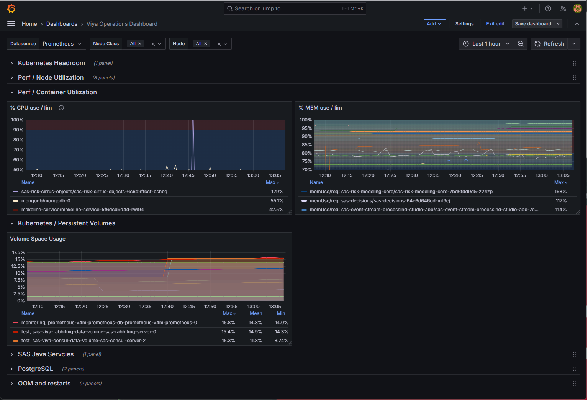

# Viya Operations Dashboard

A collection of Grafana panels for daily operations of SAS Viya.

The dashboard helps administrators identify abnormal conditions in a few minutes during routine health checks.

## Import

Import the dashboard JSON file from the Grafana Dashboard Import page.

## Features

- Focused on daily operational checks.
- Designed to reduce navigation and filtering.
- Includes commonly used metrics for CPU, memory, storage, Kubernetes, and PostgreSQL.
- Excludes containers that consistently show high utilization and are less useful for daily health checks (for example, pgBackRest).

## Design Principles

This dashboard is not intended for deep investigation.

Instead, it is designed to answer a simple question:

> Is everything healthy today?

The panels were modified from existing dashboards to reduce the number of operations required during routine monitoring.

## Customization

This dashboard is intended as a starting point for SAS Viya operations.

If you find new metrics that should be monitored in daily operations, feel free to add them and customize the dashboard for your environment.

## Notes
Some containers regularly appear at the top of utilization rankings even when the environment is healthy.

Use the Hidden dashboard variable to exclude such containers from charts and rankings.

Example:
```text
pgbackrest|rabbitmq|sas-opendistro|sas-programming-environment|twistlock-defender|fluent-bit
```

## Acknowledgements

This dashboard includes panels derived from the following sources.

### SAS Viya Monitoring for Kubernetes

| Original Dashboard | Original Panel | Notes |
|-------------------|---------------|-------|
| Kubernetes Headroom | Resource by Node | Modified |
| Perf / Node Utilization | CPU Utilization | Modified |
|  | CPU Saturation (load per CPU) | Modified |
|  | Memory Utilization | Modified |
|  | Memory Saturation (Major Page Faults) | Modified |
|  | Disk IO Utilization | Modified |
|  | Net Utilization (Bytes Receive/Transmit) | Modified |
|  | Disk Capacity Used | Modified |
|  | Disk IO Saturation | Modified |
| Perf / Container Utilization | % CPU use / lim | Modified |
|  | % MEM use / lim | Modified |
| Kubernetes / Persistent Volumes | Volume Space Usage | Modified |
| SAS Java Services | JVM Heap | Modified |
| PostgreSQL | Connections | Modified |
| | Replication Lat Time (replica Only) | Modified |

### Grafana Labs

| Original Dashboard | Original Panel | Notes | ID |
|-------------------|---------------|-------|------|
| OOM and Restarts | restart | Modified | 16718 |
| | OOM Killed processes pr node delta | Modified | 16718 |

The original dashboards were used as references and were modified for daily operational monitoring.

## Screenshot




## Change Log
### Version 1.0 (28AUG2026)
- Initial version.
